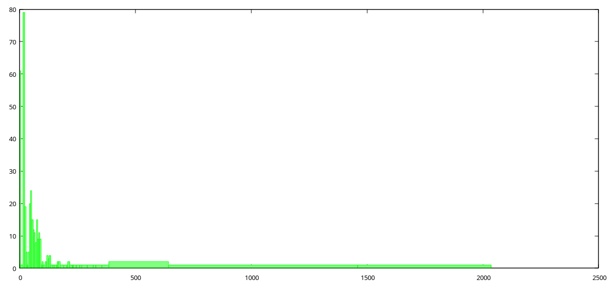

# dnstimes.sh

### Usage

```
> dnstimes.sh -h

dnstimes.sh:
-----------
    ... your.dns.sever domains.txt [port] - measure latency per domain, print results
    ... -t dtimes.txt                     - print average and standard deviation
                                            for given output of previous run
    ... -p dtimes.txt                     - plot a histogram with gnuplot for it
```

To measure for domains relevant to you it might make sense to use something like browser bookmarks as a starting point.

In most popular browsers it is easy to extract them to .html file.

Then you could use [xurls](https://github.com/mvdan/xurls) with coreutils to extract domains, e.g.

```
xurls < bookmarks.html | cut -d'/' -f3 | cut -d':' -f1 | sort -u | grep -F '.' > domains.txt
```

Now you can run dnstimes:

```
dnstimes.sh 192.168.1.80 domains.txt > dtimes.txt
```

To calculate avg and standard deviation:

```
dnstimes.sh -t dtimes.txt
```

You might also plot a histogram with gnuplot, e.g.

```
dnstimes.sh -p dtimes.txt

```


